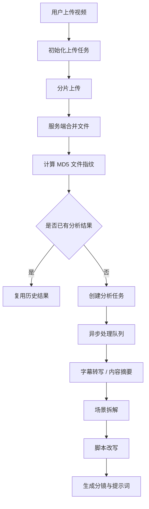

# Video Mind AI

一个面向短视频创作者的 AI 视频解析与创作工作台。系统支持视频导入、内容摘要、场景拆解、脚本改写与提示词生成，帮助创作者把参考视频整理成可复用、可继续编辑的创作素材。

## 目录

- [项目预览](#项目预览)
- [核心功能](#核心功能)
- [技术栈](#技术栈)
- [系统流程](#系统流程)
- [项目结构](#项目结构)
- [本地部署](#本地部署)
- [开发环境](#开发环境)

## 项目预览

Video Mind AI 以“视频理解 -> 结构化拆解 -> AI 创作输出”为核心流程：

```text
视频导入 -> 异步分析 -> 场景拆解 -> 脚本改写 -> 分镜与提示词输出
```

项目面向短视频创作场景，重点解决以下问题：

- 大文件上传不稳定，上传失败后需要重新提交。
- AI 视频分析耗时较长，容易阻塞接口响应。
- 相同视频重复分析会造成存储和 AI Token 浪费。
- AI 输出如果只是一段总结，后续复用和二次编辑成本较高。

## 核心功能

- **视频项目管理**：支持用户注册登录、视频上传、项目列表查看和项目详情管理。
- **分片上传**：支持视频分片上传、分片状态记录和服务端合并，提升大文件上传稳定性。
- **文件指纹去重**：服务端计算文件 MD5，识别重复内容并复用已有分析结果。
- **异步分析链路**：将字幕转写、内容摘要、场景拆解等耗时任务从上传请求中解耦。
- **场景结构化拆解**：围绕动作、台词、镜头、情绪和创意钩子生成分段结果。
- **AI 改写输出**：根据目标平台、人设、语气和受众生成脚本草稿、分镜建议和提示词包。

## 技术栈

### 后端

- Spring Boot
- MyBatis-Plus
- MySQL / H2
- Redis
- Redisson
- RocketMQ
- MinIO

### 前端

- Vue 3
- Vite
- Axios
- GSAP

### AI 与媒体处理

- FFmpeg
- ASR 服务接入
- SiliconFlow / DeepSeek-compatible API

## 系统流程



## 技术亮点

- **分片上传 + MD5 文件指纹**：实现大视频稳定上传，并通过内容级去重减少重复上传和重复分析。
- **Redisson 分布式锁与限流设计**：用于控制重复提交和高频 AI 请求，降低并发场景下的算力浪费。
- **RocketMQ 异步任务链路**：将视频分析类长耗时任务从接口请求中拆出，提升系统可扩展性。
- **结构化结果存储**：使用 `media_files`、`scene_segments`、`rewrite_drafts` 等表沉淀 AI 输出，便于后续查看、复用和编辑。
- **前后端完整闭环**：前端提供创作工作台，后端负责上传、分析、改写、缓存、存储与任务调度。

## 项目结构

```text
VideoMind-AI
├── client/                 # Vue 3 前端工作台
├── server/                 # Spring Boot 后端服务
├── docs/                   # 项目说明与设计文档
├── scripts/                # 本地辅助脚本
├── docker-compose.yml      # 本地基础设施编排
├── start-demo.cmd          # 一键启动本地演示
└── portfolio-project-intro.html
```

## 本地部署

### 1. 启动项目

Windows 环境下可以直接运行：

```bat
start-demo.cmd
```

该脚本会分别启动：

- 后端服务：`http://127.0.0.1:9090`
- 前端页面：`http://127.0.0.1:5173`

### 2. 分别启动

如果希望手动启动，也可以分别运行：

```bat
start-demo-backend.cmd
start-demo-frontend.cmd
```

### 3. 手动命令

后端：

```bat
cd server
mvnw.cmd spring-boot:run "-Dspring-boot.run.profiles=demo"
```

前端：

```bat
cd client
npm install
npm run dev -- --host 127.0.0.1 --port 5173
```

## 开发环境

- JDK 21
- Node.js 18+
- Maven Wrapper
- Windows 10 / Windows 11

## 页面入口

- 应用首页：`http://127.0.0.1:5173`
- 项目介绍页：`portfolio-project-intro.html`
